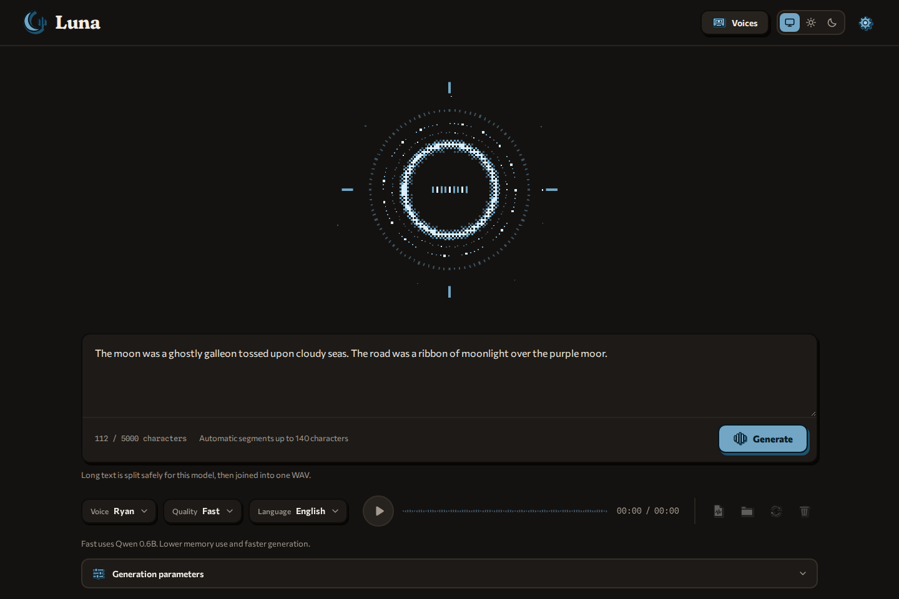
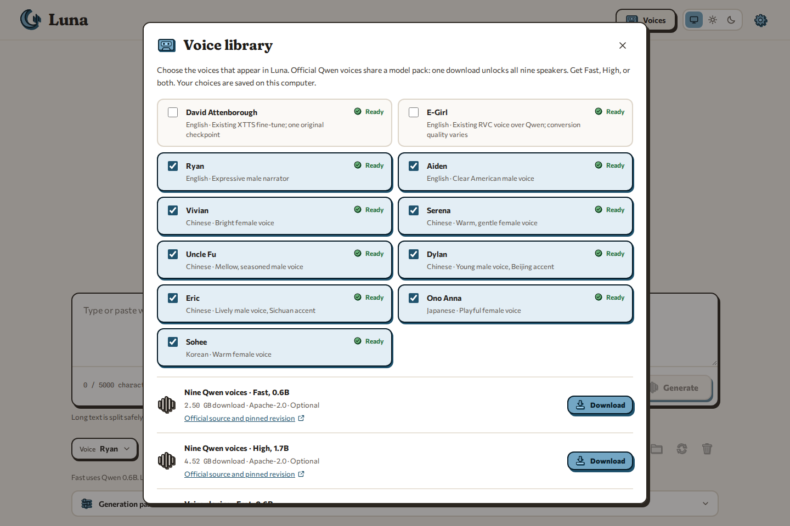

<p align="center"></p>

# Luna

Private, local GPU voice generation.



Luna is a Windows desktop app that turns text into speech with voice models running on your own
NVIDIA GPU. It runs a loopback backend inside an Electron window. Text, reference recordings, voice
profiles and generated WAV files stay on your computer.

Current version: **0.6.0**.

## Requirements

Luna needs Windows x64 and an NVIDIA GPU with driver 570 or newer (for CUDA 12.8). Larger models need
more GPU memory. Without a reachable GPU, setup still completes and says so, but generation reports
the error and produces no audio. Plan for about 5 GB for the runtime plus 2.5 to 4.5 GB per voice pack.

## Install and first start

Install Luna from Instrumenta, or run `Luna-Installer-<version>.exe` from a
[GitHub release](https://github.com/George-Nizor/Luna/releases). The installer is under 1 MB and
fetches the app package (about 110 MB), which holds no Python. Launch Luna from Instrumenta, the
Start menu or `Luna.exe`.

On first start Luna sets up its own runtime: Python 3.12 and its locked libraries, PyTorch with CUDA
12.8 among them. That is a 3.02 GB download, once. The setup screen
shows size, progress and speed. A cancelled or interrupted setup resumes on the next start. Updates
reuse the runtime unless its locked dependency set changes.

## Voices

Open **Voices** in the top bar (or **Get / manage voices** in Settings) to choose which speakers
appear in the voice menu and to download packs. The library shows exact sizes, free disk space,
sources and progress. Downloads pause and resume, and every file is checked against a pinned
revision and checksum before the pack is usable. Luna never downloads a model implicitly; a new
installation opens the library when no selected voice is ready.



- **Qwen speakers:** Ryan, Aiden, Vivian, Serena, Uncle Fu, Dylan, Eric, Ono Anna and Sohee. Fast
  uses the 0.6B CustomVoice pack (about 2.50 GB), High the 1.7B pack (about 4.52 GB). Each pack holds
  all nine speakers.
- **Voice profiles:** clone a voice from a WAV or FLAC recording you own or have permission to use,
  plus its exact transcript. This needs one of the separate Base packs (Fast about 2.52 GB, High
  about 4.54 GB).
- **David Attenborough (XTTS) and E-Girl (RVC):** legacy voices. Installations that already had them
  keep them; the voice library does not offer them to new installations. David has one quality,
  labelled **Original**. E-Girl converts the Serena speaker when the CustomVoice pack for the chosen
  quality is installed, otherwise the matching Base pack, and RVC conversion can reduce clarity.

High quality on Qwen speakers accepts an optional style direction. Qwen-based voices have a sampling
temperature from 0.2 to 1.2 (default 0.7). Every generation saves its seed, chosen or random, so you
can compare settings. Use **Unload** in Settings when another application needs the GPU.

## Text and generation

Luna speaks English, Chinese, Japanese, Korean, German, French, Russian, Portuguese, Spanish and
Italian, or detects the language with Auto. The text box enforces the backend limit of 5,000
characters. Long text is generated in segments and
joined into one WAV. Qwen segments are at most 140 characters on Fast and 100 on High, fewer if the
audio-token budget requires it. A model that runs out of audio budget returns an error instead of
saving partial speech. Generation times out after one hour by default. Limits are set by environment
variables (see [`.env.example`](.env.example)).

**Sound history** keeps every generation until you delete it. You can search by text or voice,
filter by quality, play, export the WAV or metadata, show the file in Explorer and delete it. **Reuse
text** puts the original text, voice, language, quality, style, temperature and seed back in the
editor without generating. Outputs from older versions that did not save their text cannot be
reused. Details are in [Voice catalog and generation library](docs/voice-library.md).

## Where data lives

| What | Where |
| --- | --- |
| Generated audio (default, changeable in Settings) | `%USERPROFILE%\Documents\Luna` |
| Settings, profiles, history state, logs | `%APPDATA%\Luna` |
| Downloaded voice packs | `%APPDATA%\Luna\data\model-packs` |
| Preserved legacy voices | `%APPDATA%\Luna\data\legacy` |
| Python runtime | `%LOCALAPPDATA%\Luna\runtime` |

Backend logs are in `%APPDATA%\Luna\logs\desktop-backend.log` and runtime setup failures in
`runtime-setup.log` beside it. Uninstalling removes the app and the Python runtime, and keeps your
settings, packs and generated audio. See [Identity and local data](docs/identity-and-data.md).

## Development

Development uses Windows PowerShell, [uv](https://docs.astral.sh/uv/) and Node.js.

```powershell
.\scripts\setup_dev.ps1
npm start
npm test
npm run pack
npm run dist
```

`setup_dev.ps1` builds `.venv` with uv from the same lock the installed app uses
(`packaging/runtime`), adds the test tools and runs `npm install`. `npm test` runs pytest, Ruff and
the Electron checks. `npm run pack` builds `release\win-unpacked`; `npm run dist` builds the
installer and release assets. The Python tests also run on Linux with `python -m pytest -q` after
`uv pip install -r requirements-dev.txt`.

`scripts\download_models.ps1 -Model <pack>` downloads a verified pack into the development checkout,
with `qwen-voices-fast`, `qwen-voices-high`, `qwen-clone-fast` or `qwen-clone-high`. Runtime locking,
release assembly and Instrumenta packaging are in [Release assembly](docs/releasing.md).

## Documentation

- [Voice catalog and generation library](docs/voice-library.md)
- [Identity and local data](docs/identity-and-data.md)
- [Release assembly](docs/releasing.md)
- [Publication audit](docs/publication-audit.md)
- [Brand v2 in Luna](docs/brand/README.md)
- [Third-party notices](THIRD_PARTY_NOTICES.md)

Model sources: [Qwen Fast voices](https://huggingface.co/Qwen/Qwen3-TTS-12Hz-0.6B-CustomVoice),
[Qwen High voices](https://huggingface.co/Qwen/Qwen3-TTS-12Hz-1.7B-CustomVoice),
[David XTTS](https://huggingface.co/drewThomasson/xtts_David_Attenborough_fine_tune),
[E-Girl RVC](https://voice-models.com/model/1uZvOaYhqJv). Releases contain no voice weights or
recordings.

Licence: MIT ([LICENSE](LICENSE)). Bundled components keep their own licences
([THIRD_PARTY_NOTICES.md](THIRD_PARTY_NOTICES.md)).

## Family

Luna is part of [Instrumenta](https://github.com/George-Nizor/Instrumenta), a suite of local learning
and creative apps made by [Bonehead Labs](https://boneheadlabs.org)
([GitHub](https://github.com/Bonehead-Labs)). It follows the Instrumenta brand v2: a crescent moon
with a voice, drawn as a freestanding object, in a quiet lunar blue. The interface type (Fraunces,
Commissioner, Spline Sans Mono) is SIL OFL 1.1, vendored in `app/static/brand/fonts` with its
licences. [Brand v2 in Luna](docs/brand/README.md) describes what was taken from the brand and what
was kept.
